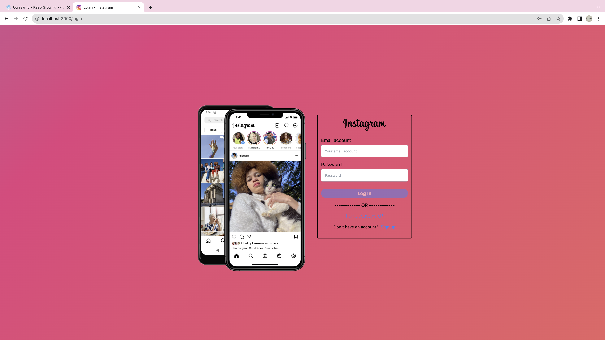
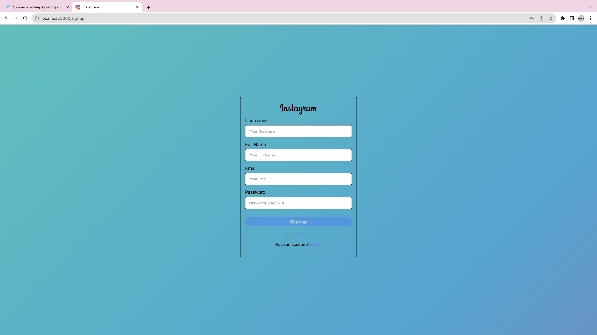
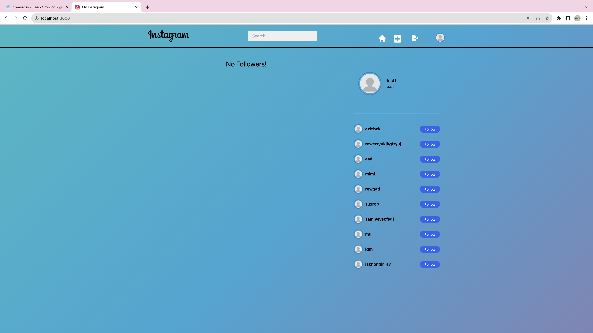
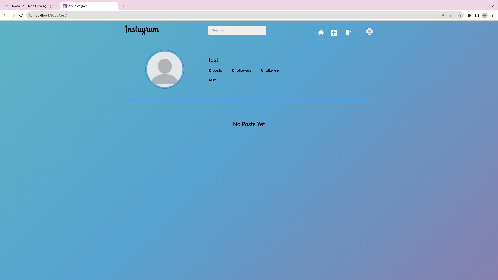
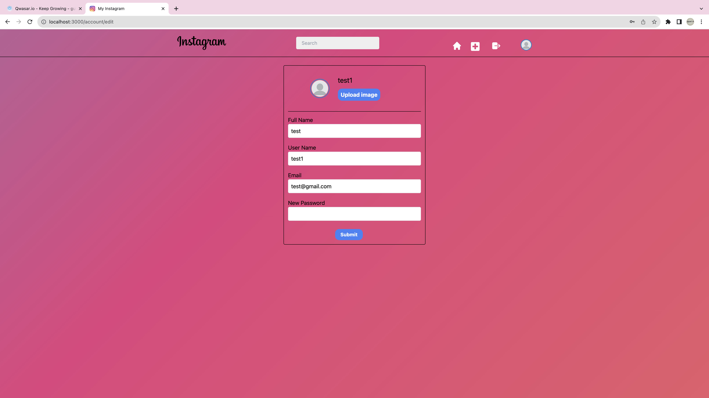

# Welcome to My Instagram
Welcome to my Instagram project

## Task
I have tried to create a clone of the Instagram app

<a href="https://noinstagram-new.netlify.app">Netlify</a>

## Description
The source of the project in <a href="https://www.youtube.com/watch?v=mDgEqoQUBgk&t=7800s">Youtube</a>

<ul>
<li>Login and Signup</li>
<li>Change you password.</li>
<li>Change account type private or public</li>
<li>Indicates that users exists as you type username when signing up.</li>
<li>About, Developer, Help, 404, No such user, No such group page.</li>
<li>Follow, Unfollow, Recommend and Profile views</li>
<li>Like, Comment (Sticker and Text), Tag, Untag, Remove tag, Copy post link, Delete post, Edit post, Open post.</li>
<li>Post Text, Image (with filters), Video, Audio, Link, Document, Location with emojis, Font size, Tag, mentions, hashtags</li>
<li>Time ago format used everywhere.</li>
<li>Custom Video and Audio player.</li>
<li>Add tags to describe yourself much more.</li>
<li>Edit your profile (From username, Fullname or Bio, social links to tags).</li>
<li>Get suggestions on whome to follow (you can also refresh suggestions).</li>
<li>Know what are some of the most popular hashtags.</li>
<li>Mutual likes and comments as in Facebook (When you see a post, if your followings have liked or commented on the post, then app re-arranges post's likers and commenters in a way that your followings get the first priority).</li>
<li>Shows images in Theatre mode.</li>
<li>Explore people, photos, videos, audios and groups.</li>
<li>Get notified on almost everything from your post being liked, commented, shared TO you being added to a group.</li>
<li>Message emoji, Text, Image, Sticker.</li>
<li>Delete conversation, unsend all your messages, edit conversation title and get all info about the conversation.</li>
<li>Bookmark the post if you liked it.</li>
<li>Add/remove members.</li>
<li>Edit group's settings.</li>
<li>Change your avatar from over 200 custom avatars, don't like it upload your avatar with a cropping tool.</li>
<li>If a text post is large, then a glimpse of the post is shown and you can load more.</li>
<li>Search users.</li>
</ul>

## Installation
after getting the code you should install the react
```
npm i or npm install
```
then you should run the code 
```
npm stert
```

## Usage
TODO - How does it work?
```
./my_project argument1 argument2
```

# Photos








### The Core Team
Nodir Gulmurodov Gulmurod_n

<span><i>Made at <a href='https://qwasar.io'>Qwasar SV -- Software Engineering School</a></i></span>
<span></span>
